# 📝 MERN Stack Todo Application

> A production-ready todo application with automated CI/CD pipeline and GitOps deployment

## 🚀 Overview

Full-stack todo application built with the MERN stack, featuring a complete DevOps pipeline with Jenkins for CI/CD and ArgoCD for GitOps-based Kubernetes deployment.

## ✨ Features

- 🎨 Modern React frontend with responsive design
- ⚡ RESTful API built with Node.js and Express
- 🗄️ MongoDB for data persistence
- 🔄 Automated CI/CD with Jenkins
- 🔐 Security scanning with SonarQube and Trivy
- 📦 Containerized with Docker
- ☸️ Kubernetes orchestration
- 🔁 GitOps deployment with ArgoCD
- 📊 Monitoring with Prometheus & Grafana

---

## 🏗️ Architecture


---

## 🔧 Tech Stack

**Frontend**
- React.js
- Axios for API calls

**Backend**
- Node.js
- Express.js
- MongoDB

**DevOps**
- Jenkins (CI/CD)
- ArgoCD (GitOps)
- Docker & Docker Hub
- Kubernetes
- Helm

**Monitoring & Security**
- Prometheus
- Grafana
- SonarQube
- Trivy

---

## 📋 Prerequisites

Before you begin, ensure you have:

- ☸️ Kubernetes cluster (v1.20+)
- 🔨 Jenkins with Docker support
- 🐳 Docker Hub account
- 📦 Helm 3.x installed
- 🔑 Necessary credentials configured

---

## 🚀 CI/CD Pipeline

The Jenkins pipeline automates the entire deployment process:

```mermaid
graph LR
    A[Code Commit] --> B[Jenkins Pipeline]
    B --> C[npm install, test]
    C --> D[ npm run build ]
    D --> E[SonarQube Analysis]
    E --> F[Trivy Security Scan]
    F --> G[Build Docker Images]
    G --> H[Push to Docker Hub]
    H --> I[Update K8s Manifests]
    I --> J[ArgoCD Sync]
    J --> K[Deploy to Kubernetes]
```



**Pipeline Stages:**
1. 📥 **Install & Build** - Runs `npm install`, tests, and builds for both frontend and backend
2. 🔍 **Code Quality** - SonarQube analysis for code quality and security
3. 🛡️ **Security Scan** - Trivy scans Docker images for vulnerabilities
4. 🐳 **Docker Build & Push** - Builds and pushes images to Docker Hub
5. 📝 **Manifest Update** - Updates Kubernetes manifests with new image tags using `sed`
6. 🔄 **GitOps Deployment** - ArgoCD monitors and deploys changes automatically

---

## 📦 Setup Instructions

### Step 1: Configure CI/CD Pipeline

Set up Jenkins pipeline using the `Jenkinsfile` in the repository:

```bash
# Ensure Jenkins has access to:
# - Docker Hub credentials
# - SonarQube token
# - Kubernetes cluster config
```

### Step 2: Install Kubernetes Components

Run the provided script to install required Helm charts:

```bash
chmod +x required-helm-charts.sh
./required-helm-charts.sh
```

This script installs:
- ArgoCD
- Prometheus
- Grafana

> ⚠️ **Important:** Please edit `axios.js` and the Helm charts installation script as per your requirements before running.

### Step 3: Access the Application

Once deployed, access the application through the Ingress load balancer endpoint.

---

## 📸 Screenshots

### Application UI


### SonarQube Analysis


### Kubernetes Resources


### ArgoCD Dashboard


### Grafana Monitoring


---

## 📁 Repository Structure

```
mern-todo-app/
├── frontend/
│   ├── src/
│   ├── public/
│   ├── package.json
│   └── Dockerfile
├── backend/
│   ├── src/
│   ├── package.json
│   └── Dockerfile
├── k8s/
│   ├── backend-dep.yml
│   ├── frontend-dep.yml
│   ├── mongo-db-vpa.yml
│   ├── mongo-statefulset.yml
│   ├── ingress.yml
│   └── config.yml
|   |__ required-helm-charts.sh
├── Jenkinsfile
└── README.md
```

---

## 🔐 Security

- Container images scanned with Trivy
- Code quality gates with SonarQube
- Kubernetes security best practices
---

## 📊 Monitoring

Access monitoring dashboards:

- **Grafana**: `http://<instanceip>:port`
- **Prometheus**: `http://<instanceip>:port`
- **ArgoCD**: `http://<instanceip>:port`

---

## 👤 Author

**Sai Rathod**

---

<p align="center">Made with ❤️ using MERN Stack and DevOps best practices</p>
